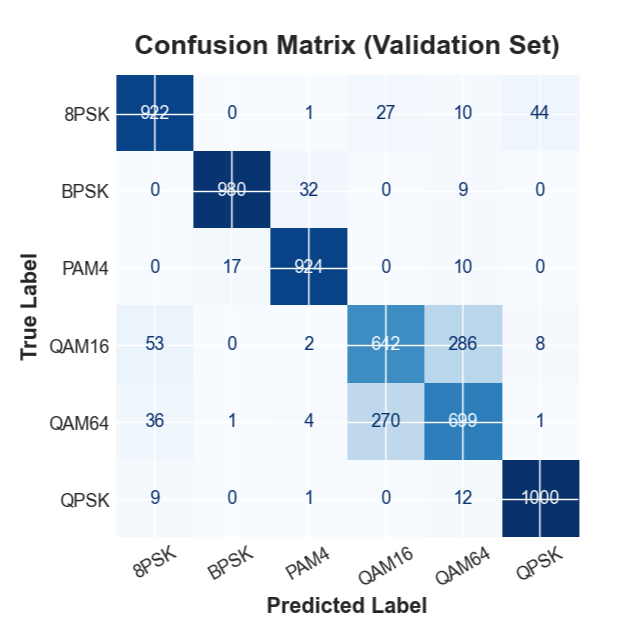
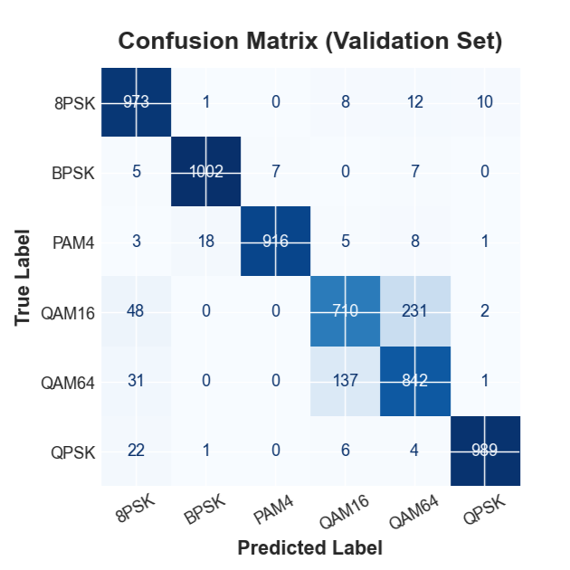
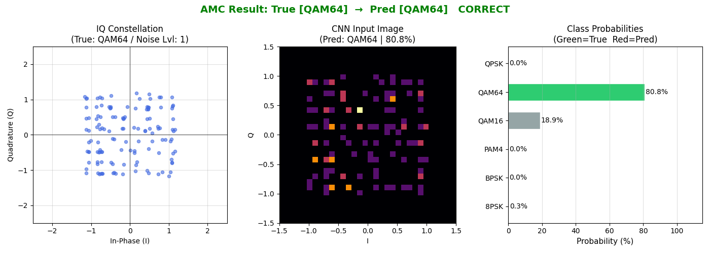
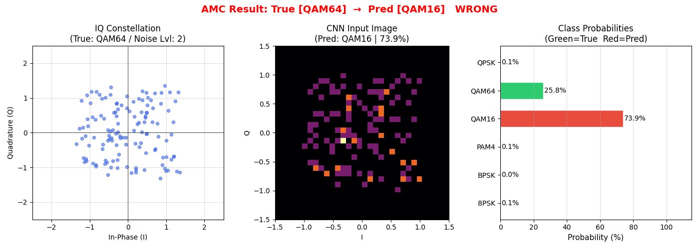

# Automatic Modulation Classification

> RadioML IQ 신호를 32×32 성상도 이미지로 변환하고, MobileNetV3 Small과 ResNet-18의 정확도·연산 효율을 비교한 경량 Automatic Modulation Classification 프로젝트다.

<p align="center">
  
</p>

## 프로젝트 개요

Automatic Modulation Classification(AMC)은 송신자의 사전 정보 없이 수신된 무선 신호의 변조 방식을 식별하는 기술이다. 인지 무선통신, 동적 스펙트럼 관리, 지능형 수신기와 같이 채널 상태에 따라 빠른 판단이 필요한 환경에서 활용할 수 있다.

본 프로젝트에서는 **RadioML 2016.10a** 데이터셋의 I/Q 샘플을 CNN이 처리할 수 있는 2차원 성상도 이미지로 변환하였다. 이후 경량 모델인 **MobileNetV3 Small**과 비교 모델인 **ResNet-18**을 동일한 조건에서 학습하여 분류 정확도뿐 아니라 파라미터 수, FLOPs, 모델 메모리, CPU 추론 시간을 함께 비교하였다.

분류 대상은 다음 6종이다.

```text
BPSK, QPSK, 8PSK, PAM4, QAM16, QAM64
```

## 프로젝트 목표

- I/Q 시계열 신호를 32×32 성상도 밀도 이미지로 변환하는 전처리 파이프라인을 설계한다.
- MobileNetV3 Small과 ResNet-18을 1채널·6클래스 AMC 분류기로 개조한다.
- 검증셋 기준 정확도, SNR별 성능, 혼동행렬을 통해 모델의 분류 특성을 분석한다.
- 파라미터, FLOPs, 메모리, CPU 추론 시간을 비교하여 경량 모델의 Edge AI 적용 가능성을 평가한다.
- 가상 변조 신호와 AWGN 잡음을 생성하여 학습된 모델의 추론 결과와 실패 사례를 확인한다.

## 전체 파이프라인

```text
RadioML I/Q samples
        ↓
AGC normalization
        ↓
32×32 2D histogram
        ↓
Gaussian smoothing
        ↓
Constellation image
        ↓
MobileNetV3 Small / ResNet-18
        ↓
6-class modulation prediction
```

### 1. AGC 정규화

I/Q 샘플을 최대 절댓값으로 나누어 신호 크기를 정규화한다. 절대 진폭의 영향을 줄이고 변조 방식별 기하학적 패턴이 일정한 범위에 나타나도록 구성하였다.

### 2. 성상도 이미지 변환

I축과 Q축을 각각 32개 구간으로 나누고 `numpy.histogram2d`를 사용해 32×32 밀도 이미지를 생성한다. 산점도 형태의 I/Q 신호를 CNN이 처리할 수 있는 단일 채널 이미지로 변환하는 단계다.

### 3. Gaussian smoothing

희소하게 분포한 픽셀을 CNN이 안정적으로 인식할 수 있도록 `sigma=0.3`의 약한 Gaussian smoothing을 적용한다. 이후 최댓값으로 나누어 픽셀값을 0~1 범위로 정규화한다.

## 데이터 구성

| 항목 | 설정 |
|---|---|
| Dataset | RadioML 2016.10a |
| Target classes | BPSK, QPSK, 8PSK, PAM4, QAM16, QAM64 |
| SNR range | 10, 12, 14, 16, 18 dB |
| Total samples | 30,000 |
| Training set | 24,000 (80%) |
| Validation set | 6,000 (20%) |
| Input shape | 1 × 32 × 32 |
| Split seed | 42 |

저장소에는 데이터셋을 포함하지 않는다. `RML2016.10a_dict.pkl`을 프로젝트 루트에 배치한 뒤 학습 코드를 실행해야 한다.

## 모델 설계

### MobileNetV3 Small

PyTorch의 `mobilenet_v3_small(weights=None)`을 기반으로 다음 부분을 변경하였다.

- 첫 번째 합성곱의 입력 채널을 RGB 3채널에서 성상도 이미지 1채널로 변경하였다.
- 마지막 분류기의 출력 노드를 ImageNet 1,000개 클래스에서 AMC 6개 클래스로 변경하였다.
- 분류기 내부에 Dropout을 적용하여 과적합을 완화하였다.

MobileNetV3의 Depthwise Separable Convolution과 Squeeze-and-Excitation 구조를 활용해 연산량과 메모리 사용량을 줄이는 것을 목표로 하였다.

### ResNet-18

PyTorch의 `resnet18(weights=None)`을 기반으로 32×32 입력에 맞게 구조를 수정하였다.

- 첫 번째 합성곱을 `7×7, stride=2`에서 `3×3, stride=1`로 변경하였다.
- 초기 MaxPool을 제거하여 작은 성상도 이미지의 공간 정보 손실을 줄였다.
- 입력 채널을 1채널로 변경하였다.
- 마지막 분류기를 Dropout과 6클래스 출력층으로 교체하였다.

## 학습 설정

| Hyperparameter | Value |
|---|---:|
| Optimizer | Adam |
| Loss | CrossEntropyLoss |
| Batch size | 128 |
| Maximum epochs | 30 |
| Initial learning rate | 0.001 |
| Weight decay | 1e-4 |
| LR scheduler | ReduceLROnPlateau |
| Early stopping | Validation loss 기준 |

두 모델은 검증 손실이 가장 낮은 체크포인트를 저장하고, 학습 종료 후 해당 가중치를 다시 불러와 최종 평가를 수행한다. SNR별 정확도와 혼동행렬도 **검증셋만을 대상으로 계산**한다.

## 핵심 결과

| Metric | MobileNetV3 | ResNet-18 | 비교 |
|---|---:|---:|---:|
| Best validation accuracy | **86.12%** | **90.53%** | -4.41%p |
| Parameters | **1.52M** | 11.17M | 7.3× 감소 |
| FLOPs | **0.0044G** | 1.1134G | 약 253× 감소 |
| Model memory | **5.86MB** | 42.65MB | 7.3× 감소 |
| CPU inference time | **1.64ms** | 3.87ms | 약 2.4× 빠름 |

MobileNetV3는 ResNet-18보다 검증 정확도가 약 4.4%p 낮았지만, 파라미터와 메모리를 약 7.3배 줄이고 연산량을 약 253배 줄였다. 제한된 연산 자원을 갖는 Edge 환경에서는 정확도와 효율 사이의 실용적인 절충안이 될 수 있음을 확인하였다.

> 추론 시간은 실행 환경과 시스템 부하에 따라 달라질 수 있다. 비교 코드에서는 두 모델을 동일한 CPU 환경에서 반복 추론하여 평균 시간을 측정한다.

## 클래스별 성능 분석

<p align="center">
  
  
</p>

### MobileNetV3

BPSK, QPSK, PAM4와 같이 성상도 구조가 뚜렷한 클래스는 비교적 안정적으로 분류하였다. 가장 큰 오분류는 QAM16과 QAM64 사이에서 발생하였다. MobileNetV3 혼동행렬에서 QAM16 샘플 286개를 QAM64로, QAM64 샘플 270개를 QAM16으로 분류하였다.

### ResNet-18

ResNet-18은 QAM 계열의 구분에서 MobileNetV3보다 개선된 결과를 보였다. QAM16→QAM64 오분류는 231개, QAM64→QAM16 오분류는 137개로 감소하였다. 모델 용량이 증가하면서 밀도가 유사한 고차 QAM 성상도의 세부 경계를 더 잘 학습한 것으로 해석하였다.

두 모델 모두 QAM16과 QAM64 사이에서 가장 많은 혼동을 보였다. QAM16의 4×4 격자 구조가 QAM64의 8×8 격자 내부에 포함되며, 잡음이 증가하면 두 성상도의 밀도 분포가 유사해지기 때문이다.

## 가상 신호 추론 테스트

학습 데이터와 별도로 BPSK, QPSK, 8PSK, PAM4, QAM16, QAM64 신호를 생성하고 단계별 AWGN을 추가하여 추론 결과를 확인하였다. 테스트 화면은 원본 I/Q 산점도, CNN 입력 이미지, 클래스별 Softmax 확률을 함께 표시한다.

### 성공 사례: QAM64 분류

<p align="center">
  
</p>

노이즈 레벨 1의 QAM64 신호를 QAM64로 분류하였다. QAM64 확률은 80.8%, QAM16 확률은 18.9%로 나타났다. 예측은 성공했지만 두 QAM 클래스가 유사한 특징을 공유한다는 점도 확률 분포에서 확인할 수 있다.

### 실패 사례: QAM64를 QAM16으로 오분류

<p align="center">
  
</p>

노이즈 레벨 2에서는 QAM64를 QAM16으로 오분류하였다. QAM16 확률은 73.9%, QAM64 확률은 25.8%였다. 이 사례는 검증셋 혼동행렬에서 관찰된 QAM16–QAM64 상호 오분류 경향과 일치한다.

## 프로젝트 구조

```text
Automatic_Modulation_Classification/
├─ src/
│  ├─ __init__.py
│  ├─ train_mobilenetv3.py
│  └─ train_resnet18.py
│
├─ compare_models.py
├─ test_virtual_signals.py
├─ RML2016.10a_dict.pkl        # 별도 준비
│
├─ models/
│  ├─ classes.pkl
│  ├─ mobilenetv3_best.pth
│  ├─ mobilenetv3_final.pth
│  ├─ resnet18_best.pth
│  └─ resnet18_final.pth
│
├─ results/
│  ├─ mobilenetv3_metrics.json
│  ├─ resnet18_metrics.json
│  ├─ mobilenetv3_training_result.png
│  ├─ resnet18_training_result.png
│  ├─ model_comparison.png
│  ├─ model_dashboard.png
│  ├─ mobilenetv3_confusion_matrix.png
│  ├─ resnet18_confusion_matrix.png
│  ├─ qam64_correct.png
│  └─ qam64_misclassified_as_qam16.png
│
├─ requirements.txt
├─ .gitignore
└─ README.md
```

## 실행 방법

### 1. 저장소 복제

```bash
git clone https://github.com/raccoon297/Image_Processing.git
cd Image_Processing/Automatic_Modulation_Classification
```

### 2. 패키지 설치

```bash
pip install -r requirements.txt
```

주요 패키지는 다음과 같다.

```text
torch
torchvision
numpy
scipy
matplotlib
scikit-learn
tqdm
thop
```

### 3. 데이터셋 배치

프로젝트 루트에 다음 파일을 배치한다.

```text
Automatic_Modulation_Classification/RML2016.10a_dict.pkl
```

### 4. 모델 학습

```bash
python src/train_mobilenetv3.py
python src/train_resnet18.py
```

학습이 완료되면 가중치는 `models/`, 학습 그래프와 JSON 지표는 `results/`에 저장된다.

### 5. 모델 비교

```bash
python compare_models.py
```

`mobilenetv3_metrics.json`과 `resnet18_metrics.json`의 최고 검증 정확도를 읽어 모델 비교 이미지와 대시보드를 생성한다. 파라미터, FLOPs, 모델 메모리, CPU 추론 시간은 실행 시 자동으로 계산한다.

### 6. 가상 신호 테스트

```bash
python test_virtual_signals.py
```

실행 후 MobileNetV3 또는 ResNet-18을 선택하고, 테스트할 변조 방식과 AWGN 강도를 입력한다.

## 한계

### QAM16과 QAM64의 구조적 중첩

QAM16의 성상도 패턴은 QAM64 내부 격자와 구조적으로 겹친다. 잡음이 증가하면 외곽 성단과 내부 성단의 밀도 차이가 약해져 두 클래스를 구분하기 어렵다. 실제 혼동행렬과 가상 신호 테스트에서도 이 문제가 가장 큰 오분류 원인으로 나타났다.

### 시간적 정보 손실

I/Q 시계열을 2차원 히스토그램으로 누적하는 과정에서 샘플의 시간 순서가 제거된다. 따라서 위상 변화나 주파수 전이처럼 시간축에 나타나는 특징을 직접 학습하기 어렵다. 현재 방식은 성상도 구조가 뚜렷한 진폭·위상 변조에 적합하지만 CPFSK, GFSK와 같은 주파수 변조로 확장할 때 한계가 있다.

### 제한된 SNR 범위

본 실험은 10dB 이상의 비교적 높은 SNR 구간만 사용하였다. 저SNR 환경과 실제 SDR 수집 신호에 대한 성능은 별도의 검증이 필요하다.

## 향후 개선 방향

- 1D CNN 또는 LSTM을 결합하여 I/Q 샘플의 시간적 연속성을 함께 학습한다.
- QAM16과 QAM64 구분을 개선하기 위해 다중 해상도 성상도 또는 원본 I/Q 특징을 결합한다.
- 저SNR 구간을 포함하고 클래스별 데이터 증강을 적용해 잡음 강건성을 높인다.
- 여러 랜덤 시드로 반복 실험하여 평균 성능과 표준편차를 제시한다.
- ONNX 또는 TensorRT 변환을 통해 실제 Edge 디바이스의 지연 시간과 메모리 사용량을 측정한다.
- SDR에서 수집한 실제 무선 신호를 사용해 도메인 차이에 대한 일반화 성능을 검증한다.

## 참고 자료

- RadioML 2016.10a, DeepSig Dataset
- T. J. O’Shea, J. Corgan, and T. C. Clancy, “Convolutional Radio Modulation Recognition Networks,” EANN, 2016.
- Q. Zheng et al., “A Real-Time Constellation Image Classification Method of Wireless Communication Signals Based on the Lightweight Network MobileViT,” *Cognitive Neurodynamics*, 2024.
- N. Wang et al., “Multidimensional CNN-LSTM Network for Automatic Modulation Classification,” *Electronics*, 2021.
