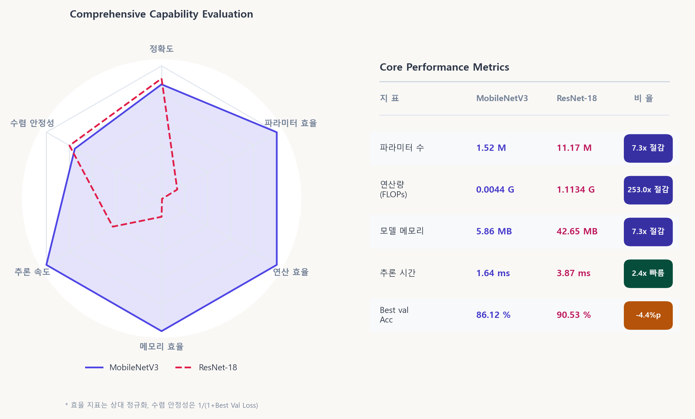
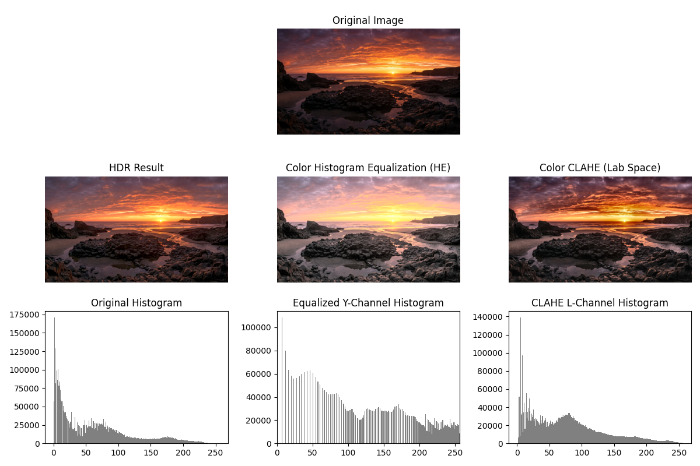
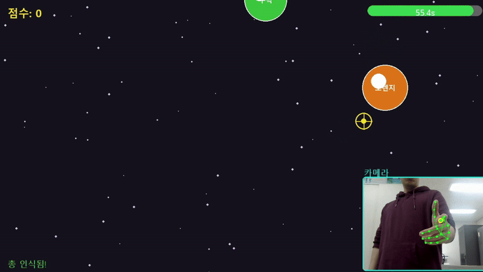

<div align="center">

# Image Processing Projects

영상 신호 처리를 학습하며 수행한 세 개의 프로젝트를 정리한 저장소다.

전통적인 영상 대비 향상 기법, 딥러닝 기반 무선 신호 분류 등 서로 다른 형태의 영상 신호 처리 문제를 다룬다.

</div>

---

## Featured Project

### [Lightweight Automatic Modulation Classification](./Automatic_Modulation_Classification)

RadioML I/Q 신호를 `32 × 32` 성상도 이미지로 변환하고,  
MobileNetV3 Small과 ResNet-18의 **정확도–연산 비용 trade-off**를 비교하였다.

<p align="center">
  <a href="./Automatic_Modulation_Classification">
    
  </a>
</p>


**핵심 구현**

- AGC 정규화와 2D histogram을 이용한 I/Q 성상도 이미지 변환
- 1채널·6클래스 MobileNetV3 Small 및 ResNet-18 설계
- 정확도, 혼동행렬, SNR별 성능, FLOPs, 메모리와 CPU 지연 시간 비교
- 가상 변조 신호와 AWGN을 이용한 성공·실패 사례 분석

<p align="right"><a href="./Automatic_Modulation_Classification"><b>View project →</b></a></p>

---

## Visual Projects

<table>
  <tr>
     <td width="50%" valign="top">
      <h3 align="center"><a href="./Image_Contrast_Enhancement_Comparison">Contrast Enhancement</a></h3>
      <a href="./Image_Contrast_Enhancement_Comparison">
        
      </a>
      <p>
        Pseudo-HDR, Exposure Fusion, Histogram Equalization과 CLAHE의 밝기·대비 개선 특성을 이미지와 히스토그램으로 비교한 프로젝트
      </p>
      <p><code>OpenCV</code> <code>NumPy</code> <code>Image Processing</code></p>
    </td>
    <td width="50%" valign="top">
      <h3 align="center"><a href="./fruit_shooting">Hand Gun Fruit Shooter</a></h3>
      <a href="./fruit_shooting">
        
      </a>
      <p>
        MediaPipe의 21개 손 랜드마크로 총 모양, 조준점, 발사 동작을 인식하고 제어하는 Pygame 기반 슈팅 게임 프로젝트
      </p>
      <p><code>MediaPipe</code> <code>OpenCV</code> <code>Pygame</code></p>
    </td>
  </tr>
</table>

---

## Projects

| Project                                                                          | Description                                                                             | Main Technologies                 |
| -------------------------------------------------------------------------------- | --------------------------------------------------------------------------------------- | --------------------------------- |
| [Image Contrast Enhancement Comparison](./Image_Contrast_Enhancement_Comparison) | HDR, Histogram Equalization, CLAHE 및 컬러 영상 확장 기법의 결과를 비교한 프로젝트다.                        | Python, OpenCV, Image Processing          |
| [Automatic Modulation Classification](./Automatic_Modulation_Classification)     | RadioML I/Q 신호를 성상도 이미지로 변환하고 MobileNetV3 Small과 ResNet-18의 변조 분류 성능과 연산 효율을 비교한 프로젝트다. | Python, PyTorch, Deep Learning    |
| [Hand Gun Fruit Shooter](./fruit_shooting)                                       | MediaPipe 기반 손동작 인식과 웹캠 영상을 이용하여 과일을 조준하고 발사하는 게임을 구현한 프로젝트다.                           | Python, OpenCV, MediaPipe, Pygame |

각 프로젝트 폴더의 README에는 문제 정의, 구현 방식, 실행 방법, 결과와 한계를 상세히 기록했습니다.

---

## Repository Structure

```text
Image_Processing/
├─ Automatic_Modulation_Classification/
│  ├─ src/
│  ├─ results/
│  └─ README.md
├─ fruit_shooting/
│  ├─ fruit_shooter/
│  ├─ results/
│  └─ README.md
├─ Image_Contrast_Enhancement_Comparison/
│  ├─ images/
│  └─ README.md
└─ README.md
```
