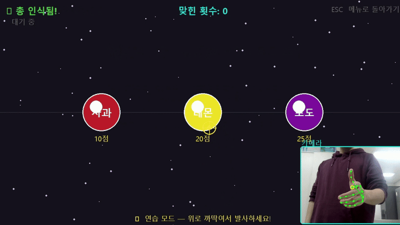

# Hand Gun Fruit Shooter

웹캠으로 손동작을 인식하여 화면의 과일을 조준하고 맞히는 간단한 슈팅 게임이다.

영상신호처리 과목을 수강하던 중 손 랜드마크를 게임 조작에 활용해 보고자 제작한 취미 프로젝트다. 구현 과정에서 발생한 조준점 떨림, 손 모양 인식의 깜빡임, 의도하지 않은 발사 문제를 완화하는 데 중점을 두었다.

---

## 1. 프로젝트 소개

MediaPipe Hand Landmarker를 이용하여 웹캠 영상에서 손의 21개 랜드마크를 검출한다. 검지와 중지가 펴진 상태를 총 모양으로 인식하고, 검지 끝의 위치와 방향을 이용하여 조준점을 이동한다.

손을 위로 가볍게 까딱하는 동작이 감지되면 총알을 발사한다. 게임 화면, 과일과 총알의 이동, 충돌 판정, 점수 계산은 Pygame으로 구현하였다.

게임은 다음 두 가지 모드로 구성하였다.

- **게임 모드**: 제한 시간 동안 떨어지는 과일을 맞혀 점수를 획득한다.
- **연습 모드**: 고정된 표적을 이용하여 손 인식, 조준, 발사 동작을 확인한다.

---

## 2. 대표 GIF

### 게임 모드

<p align="center">
  
</p>

손동작으로 조준점을 이동하고, 떨어지는 과일을 맞혀 점수를 획득하는 과정을 보여준다.

### 연습 모드

<p align="center">
  
</p>

고정된 표적을 이용하여 총 모양 인식과 발사 동작을 반복해서 확인하는 과정을 보여준다.

---

## 3. 구현 방식

### 3.1 손 랜드마크 검출과 총 모양 판별

OpenCV로 웹캠 프레임을 입력받고, MediaPipe Hand Landmarker를 이용하여 한 손의 랜드마크를 검출한다.

손가락이 카메라 정면을 향할 때도 관절의 굽힘 정도를 판별할 수 있도록 `x`, `y`, `z` 좌표를 모두 사용하여 검지와 중지의 관절 각도를 계산하였다.

```python
def finger_angle_3d(point_a, point_b, point_c) -> float:
    vector_ab = (
        point_a.x - point_b.x,
        point_a.y - point_b.y,
        point_a.z - point_b.z,
    )
    vector_cb = (
        point_c.x - point_b.x,
        point_c.y - point_b.y,
        point_c.z - point_b.z,
    )

    dot_product = sum(a * b for a, b in zip(vector_ab, vector_cb))
    magnitude_ab = math.sqrt(sum(v * v for v in vector_ab)) + 1e-6
    magnitude_cb = math.sqrt(sum(v * v for v in vector_cb)) + 1e-6
    cosine = max(-1.0, min(1.0, dot_product / (magnitude_ab * magnitude_cb)))

    return math.degrees(math.acos(cosine))
```

검지와 중지의 각도가 설정한 기준을 모두 만족하면 총 모양 후보로 판단한다.

### 3.2 조준점 생성

검지 끝 랜드마크의 정규화 좌표를 게임 화면 좌표로 변환하여 조준점으로 사용한다. 카메라 화면의 중앙 영역을 게임 화면 전체에 대응시켜 작은 손 움직임으로도 넓은 범위를 조준하도록 구성하였다.

검지의 MCP 관절에서 손끝으로 향하는 방향 벡터를 계산하고, 해당 벡터를 총알의 발사 방향으로 사용한다.

### 3.3 발사 동작 판별

최근 여러 프레임의 조준점 위치를 저장하고, 손끝이 일정 거리 이상 위로 이동한 경우를 발사 동작으로 판정한다.

```python
self._tip_history.append(
    (
        self.aim_position[0],
        self.aim_position[1],
        direction[0],
        direction[1],
    )
)

if len(self._tip_history) == SHOT_HISTORY_SIZE:
    old_x, old_y, old_dx, old_dy = self._tip_history[0]
    _, new_y, _, _ = self._tip_history[-1]

    if old_y - new_y > SHOT_FLICK_DISTANCE:
        self.trigger_on = True
        self.shot_origin = old_x, old_y
        self.shot_direction = old_dx, old_dy
```

발사가 감지되면 손을 위로 움직이기 직전의 위치와 방향을 저장하고, 이를 기준으로 총알을 생성한다.

### 3.4 게임 처리

Pygame을 이용하여 다음 요소를 구현하였다.

- 과일의 무작위 생성과 이동
- 총알의 이동과 궤적 표현
- 원형 영역을 이용한 충돌 판정
- 과일별 점수 계산
- 제한 시간과 게임 상태 관리
- 명중 파티클과 점수 효과
- 게임 모드와 연습 모드

---

## 4. 문제 및 해결 방법

### 4.1 조준점이 심하게 떨리는 문제

웹캠에서 검출한 손끝 좌표는 손을 가만히 두어도 프레임마다 조금씩 달라졌다. 검출 좌표를 그대로 사용하면 조준점이 계속 흔들려 표적을 안정적으로 조준하기 어려웠다.

이를 완화하기 위하여 이전 조준점과 새로 검출한 좌표를 선형 보간하였다.

```python
smooth_x, smooth_y = self._smoothed_tip
self._smoothed_tip = (
    smooth_x + AIM_SMOOTH_FACTOR * (game_x - smooth_x),
    smooth_y + AIM_SMOOTH_FACTOR * (game_y - smooth_y),
)
```

현재 보간 계수는 `0.25`로 설정하였다. 새로운 좌표를 즉시 적용하지 않고 일부만 반영하여 손의 이동은 따라가면서 작은 좌표 변화에 의한 떨림을 줄였다.

### 4.2 총 모양 인식이 반복해서 켜지고 꺼지는 문제

손가락 각도가 판정 임계값 주변에 위치하면 총 모양이 프레임마다 인식과 미인식을 반복하였다.

이를 완화하기 위하여 인식 시작과 유지에 서로 다른 각도를 사용하는 히스테리시스를 적용하였다. 또한 한 프레임의 판정만으로 상태를 바꾸지 않고, 여러 프레임 동안 같은 결과가 이어질 때만 인식 상태를 변경하였다.

```python
threshold = GUN_HOLD_ANGLE if self.gun_detected else GUN_ACTIVATE_ANGLE
raw_gun_shape = index_angle > threshold and middle_angle > threshold

if raw_gun_shape:
    self.gun_invalid_frames = 0
    self.gun_valid_frames += 1
    if self.gun_valid_frames >= GUN_ACTIVATE_FRAMES:
        self.gun_detected = True
else:
    self.gun_valid_frames = 0
    self.gun_invalid_frames += 1
    if self.gun_invalid_frames >= GUN_RELEASE_FRAMES:
        self.gun_detected = False
```

현재 적용한 기준은 다음과 같다.

| 항목 | 기준 |
|---|---:|
| 총 모양 활성화 | 손가락 각도 140° 이상 |
| 총 모양 유지 | 손가락 각도 100° 이상 |
| 인식 활성화 | 3프레임 연속 인식 |
| 인식 해제 | 4프레임 연속 미인식 |

### 4.3 작은 손 움직임이 발사로 인식되는 문제

현재 프레임과 직전 프레임만 비교하면 손떨림이나 작은 움직임도 발사로 잘못 판단될 수 있었다.

최근 6프레임의 손끝 궤적을 저장하고, 처음 위치보다 마지막 위치가 위쪽으로 40픽셀 이상 이동한 경우에만 발사하도록 구성하였다. 발사 후에는 `0.35`초의 쿨다운을 적용하여 한 번의 동작으로 여러 발이 연속 생성되는 현상을 줄였다.

---

## 5. 실행 방법

### 필요 환경

- Python 3.12
- 웹캠

### 설치

```bash
pip install -r requirements.txt
```

다음 라이브러리를 사용한다.

- OpenCV
- MediaPipe
- NumPy
- Pygame

### 실행

프로젝트 루트에서 다음 명령을 실행한다.

```bash
python main.py
```

`models/hand_landmarker.task` 파일이 존재하지 않으면 최초 실행 시 MediaPipe 모델을 자동으로 내려받는다.

### 조작법

| 입력 | 동작 |
|---|---|
| 검지와 중지 펴기 | 총 모양 인식 및 조준 |
| 손을 위로 가볍게 까딱하기 | 발사 |
| `SPACE` | 게임 시작 |
| `E` | 연습 모드 시작 |
| `R` | 게임 종료 후 다시 시작 |
| `ESC` | 연습 모드에서 메뉴로 이동하거나 프로그램 종료 |

---

## 6. 프로젝트 구조

```text
fruit_shooting/
├─ main.py
├─ requirements.txt
├─ README.md
│
├─ models/
│  └─ hand_landmarker.task
│
├─ results/
│  ├─ fruit_shooting_gameplay_demo.gif
│  └─ fruit_shooting_practice_demo.gif
│
└─ fruit_shooter/
   ├─ __init__.py
   ├─ config.py
   ├─ entities.py
   ├─ hand_tracker.py
   └─ game.py
```

| 파일 | 역할 |
|---|---|
| `main.py` | 프로그램 실행 진입점 |
| `config.py` | 화면, 게임, 제스처 설정값 관리 |
| `entities.py` | 과일, 총알, 파티클 객체 정의 |
| `hand_tracker.py` | 웹캠 입력, 손 인식, 조준, 발사 판정 |
| `game.py` | 게임 상태, 충돌 처리, 렌더링, 메인 루프 |
| `hand_landmarker.task` | MediaPipe 손 랜드마크 검출 모델 |

---

## 7. 보완 계획

현재 구현은 개인 환경에서 동작을 확인하기 위한 취미 프로젝트다. 사용자와 촬영 환경에 따라 손 인식과 발사 감도가 달라질 수 있다.

추후 다음 항목을 보완할 계획이다.

- 사용자별 손동작 크기에 맞춘 조준 및 발사 감도 설정
- 조명과 카메라 환경 변화에 대한 인식 안정성 개선
- 게임 화면에서 제스처 임계값을 조절하는 설정 기능
- 효과음과 시작·종료 화면 등 게임 UI 보완
